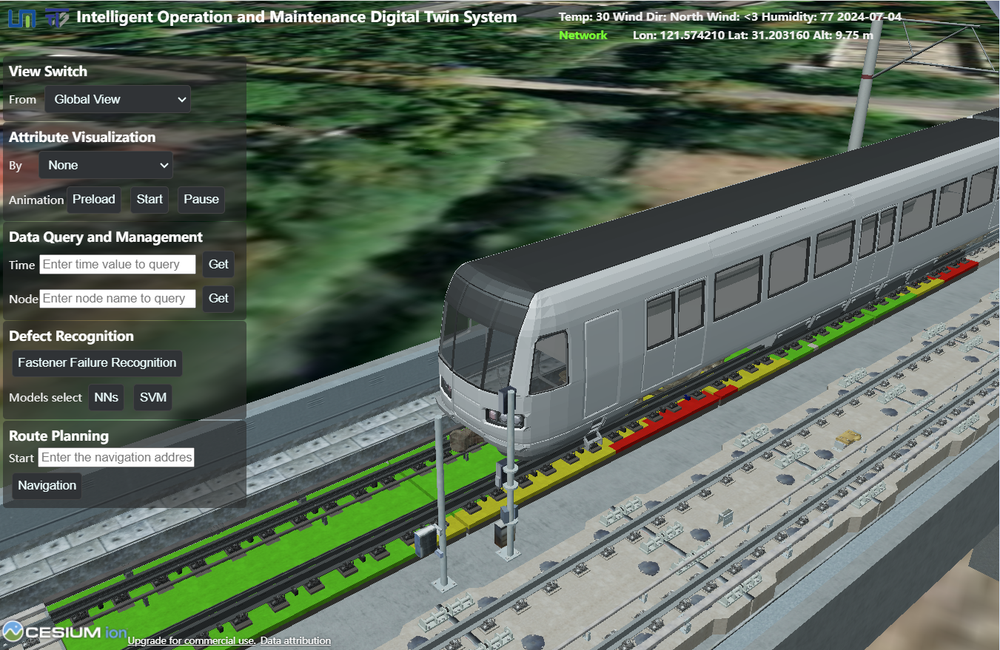
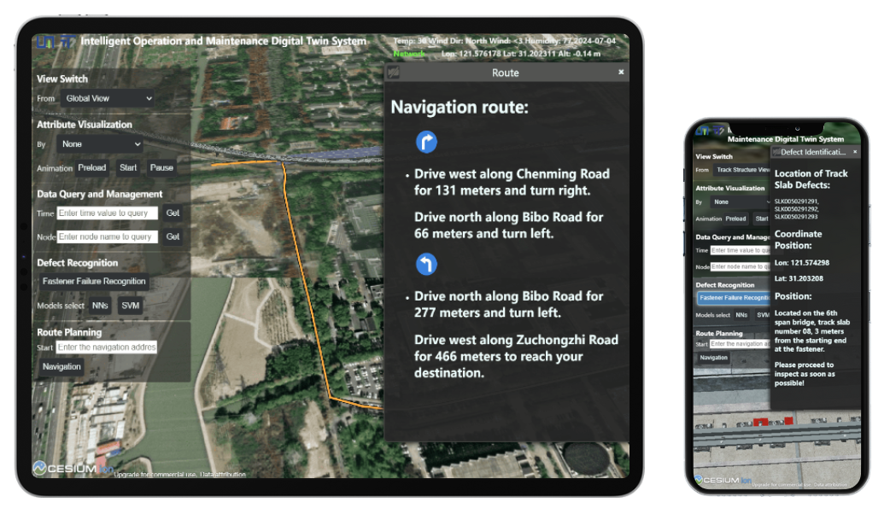

# 城市轨道交通智能运维数字孪生系统

## 项目概述
城市轨道交通智能运维数字孪生系统是基于Cesium的三维可视化平台，为城市轨道交通提供智能化运维管理解决方案。通过数字孪生技术，实现轨道交通基础设施的实时监控、数据分析、病害识别和路线规划等功能，为轨道交通的安全运行和高效维护提供技术支持。


## 项目架构


## 系统特点
- **三维可视化**：基于Cesium实现的高精度三维场景展示
- **实时监控**：支持轨道结构的实时状态监测和数据可视化
- **智能分析**：集成多种智能算法，实现病害自动识别和预警
- **数据查询**：提供灵活的数据查询和可视化功能
- **路线规划**：支持基于高德地图API的路线规划和导航

## 功能模块

### 1. 视图切换
系统提供多种预设视角：全局视图、轨道结构视图、道路视图、站点内部视图

### 2. 属性可视化
支持按照不同物理属性进行可视化展示（任一物理属性、最大振动位移、最大振动加速度），提供动画功能，可预加载数据并进行动态展示。

### 3. 数据查询及可视化
- 支持按时刻查询：输入特定时刻，获取并可视化该时刻的数据
- 支持按节点查询：输入节点名称，获取并高亮显示特定节点

### 4. 病害识别
集成多种智能算法：扣件失效识别算法、神经网络模型(NNs)、支持向量机模型(SVM)

### 5. 列车动画
提供列车运行的动态模拟功能：开始/暂停动画、视角跟随、解除视角跟随

### 6. 路线规划
基于高德地图API实现的路线规划功能，支持输入当前位置，规划最优路线，提供详细导航指引

## 技术架构
- **前端框架**：HTML5、CSS3和JavaScript
- **三维引擎**：Cesium.js
- **地图服务**：高德地图API
- **数据处理**：后端Flask服务
- **智能算法**：集成神经网络、SVM等机器学习模型

## 数据展示

系统支持多种数据的可视化展示：
- 振动位移频谱曲线
- 振动加速度频谱曲线
- 实时监测数据
- 病害预警信息
# 项目目录结构介绍

根据当前仓库的结构，城市轨道交通智能运维数字孪生系统的目录组织如下：

## 主要目录结构

```
TransitTwin/
├── Apps/           
│   ├── HelloWorld.html    # 示例页面
│   └── Sandcastle/        # Cesium Sandcastle示例和教程
├── Backend/               # 后端服务
│   ├── app.py             # Flask应用主入口
│   ├── config.py          # 配置文件
│   ├── database/          # 数据库相关文件
│   ├── database.py        # 数据库操作模块
│   ├── routes.py          # API路由定义
│   ├── 扣件失效判识算法/    # 扣件失效识别算法实现
│   └── 预测算法/           # 预测模型算法实现
├── Build/                 # 构建输出目录
│   ├── Cesium/            # Cesium编译后的生产版本
│   ├── CesiumUnminified/  
│   ├── Documentation/     
│   └── Specs/             
├── Source/                # 源代码
│   ├── Assets/            # 资源文件
│   ├── Widgets/           # UI组件
│   └── ThirdParty/        
├── ThirdParty/            # 第三方库
│   ├── codemirror-5.52.0/ 
│   ├── dojo-release-1.10.4/ 
│   └── jshint-2.13.4/     
├── demo(zh).html          # 演示页面
├── index.cjs             
├── package.json         
├── server.js      
└── web.config             
```

## 关键文件说明

1. **demo(zh).html**: 系统的主要界面文件，包含了所有前端功能的实现和UI布局。

2. **Backend/app.py**: Flask后端应用的入口点，负责启动服务器和初始化应用。

3. **Backend/routes.py**: 定义了所有API路由，处理前端的数据请求。

4. **Backend/扣件失效判识算法/**: 包含了轨道扣件失效识别的算法实现。

5. **Source/Assets/**: 存放系统使用的图片、模型等静态资源文件。

6. **Build/Cesium/**: 包含Cesium三维引擎的生产版本，用于地图和3D模型的渲染。

## 数据文件

数据文件主要存放在Backend/database/目录下，其中包含了系统所需的振动位移数据等。大型数据文件存储在Google Drive上，可通过README.txt中的链接访问：
https://drive.google.com/drive/folders/10SIBdnfFDHgWqdAbVC3VgTFro1wp6G3M?usp=sharing

## 开发和部署

系统采用前后端分离的架构：
- 前端基于Cesium实现三维可视化
- 后端使用Flask提供API服务
- 数据处理和算法部分主要在Python中实现

### 环境要求

- 浏览器（Chrome、Firefox、Edge等）
- 后端（Python + Flask）
- Cesium Ion账号（用于加载三维模型）

### 配置说明

需要配置以下参数：
- Cesium Ion Token
- 高德地图API Key

## 项目团队

- 同济大学城市交通研究院
- 同济大学交通学院
- 实验室网站：[https://huangweibuct.github.io/weihuang.github.io/](https://huangweibuct.github.io/weihuang.github.io/)
- 联系邮箱：2331791@tongji.edu.cn

## 联系方式

如有问题或建议，请联系项目负责人。

---

© 2024 同济大学城市交通研究院 & 同济大学交通学院 版权所有